# Proyecto Intermodular
## Laboratorio de Pentesting
**Por: Alberto García Prieto — 1º SMR**

---


## Índice de Contenidos

- [Proyecto Intermodular](#proyecto-intermodular)
  - [Laboratorio de Pentesting](#laboratorio-de-pentesting)
  - [Índice de Contenidos](#índice-de-contenidos)
  - [Introducción](#introducción)
  - [Requisitos](#requisitos)
    - [Hardware](#hardware)
    - [Software](#software)
  - [La identificación de vulnerabilidades](#la-identificación-de-vulnerabilidades)
  - [Tratamiento de tecnologías](#tratamiento-de-tecnologías)
    - [Tecnología 1: Nmap](#tecnología-1-nmap)
    - [Tecnología 2: WPscan](#tecnología-2-wpscan)
    - [Tecnología 3: VirtualBox (entorno controlado)](#tecnología-3-virtualbox-entorno-controlado)
  - [Prueba de pentesting](#prueba-de-pentesting)
    - [Paso 1 - Descargarnos la máquina vulnerable y desplegarla](#paso-1---descargarnos-la-máquina-vulnerable-y-desplegarla)
    - [Paso 2 - Escanear la máquina](#paso-2---escanear-la-máquina)
    - [Paso 3 - Escanear el wordpress](#paso-3---escanear-el-wordpress)
    - [Paso 4 - Buscar y explotar vulnerabilidades](#paso-4---buscar-y-explotar-vulnerabilidades)
    - [Paso 5 - Entrar al servidor](#paso-5---entrar-al-servidor)
    - [Paso 6 - Escalar privilegios](#paso-6---escalar-privilegios)
  - [Resultado final](#resultado-final)
  - [Conclusiones](#conclusiones)
  - [Consideraciones éticas](#consideraciones-éticas)
  - [Bibliografía](#bibliografía)

---

## Introducción

El crecimiento de los ciberataques ha impulsado la necesidad de realizar pruebas de seguridad en sistemas informáticos. El pentesting permite simular ataques reales para detectar vulnerabilidades antes de que sean explotadas. Para llevar a cabo estas pruebas de forma segura, es fundamental contar con un entorno controlado que evite riesgos a sistemas en producción o redes externas.

Este proyecto tiene como objetivo diseñar e implementar un laboratorio de pentesting utilizando Metasploit y Nmap como herramientas principales. Se describe la motivación, las tecnologías elegidas, la implementación práctica y los resultados obtenidos, con un enfoque académico y técnico.

---

## Requisitos

### Hardware
- Como minimo 8 GB de RAM para poder desplegar la máquina virtual
- 30 GB de almacenamiento para tener espacio disponible

### Software
- Kali Linux
- VirtualBox
- Docker
- Nmap
- WPscan

## La identificación de vulnerabilidades

Para conseguir el objetivo de este proyecto se creará un laboratorio de pentesting para probar ataques e identificar vulnerabilidades. La motivación principal es adquirir habilidades técnicas para detectar y mitigar vulnerabilidades en dispositivos propios, reduciendo el riesgo de sufrir un ciberataque. Además, se busca comprender las metodologías y herramientas utilizadas por profesionales de seguridad.

**Herramientas principales: Nmap y Phyton.**  
Nmap se utilizará para reconocimiento y escaneo de red, identificación de puertos abiertos y servicios, además de poder identificar el sistema operativo de la máquina objetivo. Phyton se empleará para la explotación controlada de vulnerabilidades y verificación de parches.

Además usaré VirtualBox para crear un entorno virtualizado y aislado con máquinas vulnerables descargadas desde DockerLabs y también alguna que nos descargaremos de VulnHub. Sin embargo, el uso principal por el que necesitamos VirtualBox es porque los ataques los realizaremos desde una máquina virtual de Kali Linux.

---

## Tratamiento de tecnologías

### Tecnología 1: Nmap

**Descripción y utilidad:**  
Nmap (Network Mapper) es una herramienta de código abierto para el descubrimiento de red y auditoría de seguridad. Permite identificar hosts activos, puertos abiertos, servicios y sistemas operativos. En este proyecto, Nmap facilita el reconocimiento inicial del laboratorio.

**Implementación en el proyecto:**  
Se ejecutarán escaneos desde la máquina atacante hacia las máquinas objetivo dentro de la red virtual.

**Comandos clave (ejemplos):**
```bash
nmap -sS -p- IP_OBJETIVO
nmap -sV -A IP_OBJETIVO
```


**Resultados esperados:**  
Identificación de servicios vulnerables y puertos de interés que orientarán las posteriores fases de explotación.

---

### Tecnología 2: WPscan

**Descripción y utilidad:**  
WP scan es una herramienta de código abierto para el análisis de páginas web creada con Wordpress. Permite identificar los plugins instalados, su versión y muchas cosas más.

**Implementación en el proyecto:**  
Se empleará para analizar la página objetivo e investigar para ver si podemos encontrar algo que nos ayude a entrar

**Ejemplo de comando:**
```bash
wpscan --url URL_OBJETIVO
```


---

### Tecnología 3: VirtualBox (entorno controlado)

VirtualBox es un programa de virtualización que permite crear máquinas virtuales aisladas de nuestro propio ordenador

Me descargaré la máquina virtual de Kali Linux y la configuraré para darle la mayoría de recursos de mi ordenador para facilitar su funcionamiento y asegurarme de que tenga la potencia que necesita para poder hacer las prácticas.

**Implementación en el proyecto:**  
Configuración de una red interna en VirtualBox para que las VMs puedan comunicarse únicamente entre sí, evitando fugas a la red externa. Se documentarán las instantáneas de las pruebas para comprobar su ejecución

---

## Prueba de pentesting
Seguiremos el curso de ciberseguridad creado por [El Pinguino de Mario](https://www.youtube.com/@ElPinguinoDeMario), en el cual aprenderemos a entrar en uná página web creada con Wordpress. Seguiremos los pasos 1 a 1.

### Paso 1 - Descargarnos la máquina vulnerable y desplegarla
Para el primer paso deberemos dirigirnos a la página [Dockerlabs](https://dockerlabs.es/) en nuestra máquina virtual de Kali Linux. Esta es una página creada por el propio Mario para almacenar máquinas vulnerables que pueden ser usadas para practicar pentesting, y la que usaremos ahora se llama Bigwear.
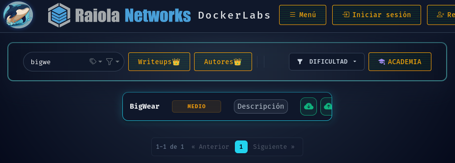
Despues de descargarnosla las descomprimimos en el escritorio, y utilizamos el comando 
```bash
sudo bash auto_deploy.sh bigwear.tar
```
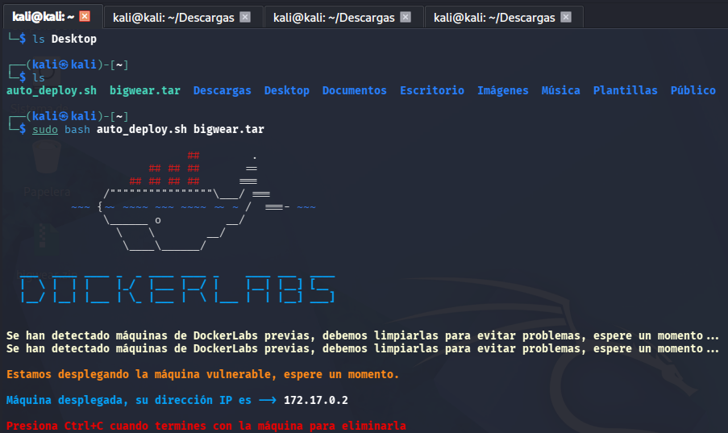
 
Una vez con la máquina desplegada podemos empezar a atacarla.

### Paso 2 - Escanear la máquina
Ya que tenemos la máquina desplegada, vamos a empezar a escanearla. 
Usaremos la herramienta Nmap, la más popular para escaneo de puertos.
Vamos a utilizar el comando 
```bash
sudo nmap -p- -sS -sC --min-rate 5000 -n -vvv -Pn 172.17.0.2 -on escaneo
```
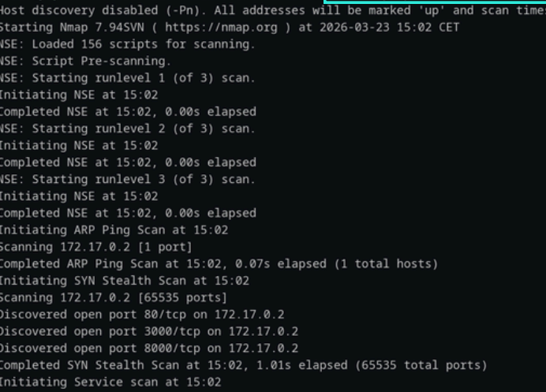

Vemos que el puerto 80 está abierto, eso significa que esa ip aloja una página web. Al poner la ip en el buscador, vemos que nos lleva a una página web de Wordpress.
### Paso 3 - Escanear el wordpress
Una vez hemos identificado que se usa Wordpress, usaremos una herramienta llamada WPscan para escanear en mayor profundidad, usando el comando:
```bash
wpscan --url http://172.17.0.2/ -e u,p
```
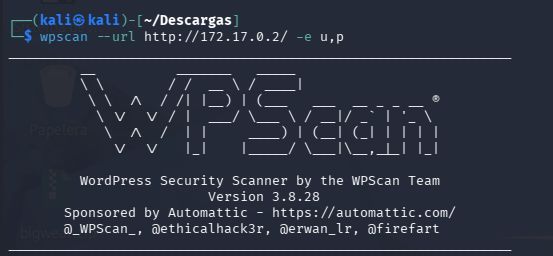

Una vez iniciado revisamos el resultado a ver si encontramos algo interesante
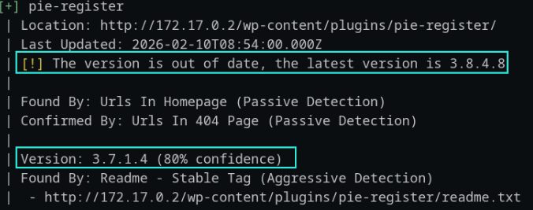
Como podemos ver, encontramos que tiene instalado un plugin llamado pie register, el cual tiene una version desactualizada.

### Paso 4 - Buscar y explotar vulnerabilidades

Tras buscarlo en internet, vemos que hay una vulnerabilidad y que hay un exploit para conseguir las cookies de administrador
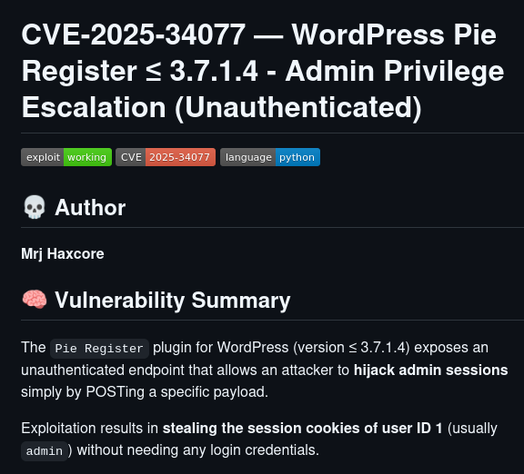

Nos descargamos el exploit, el cual está programado en python. Lo desplegamos con el comando:
```bash
python3 pie.py http://172.17.0.2/ 
```
Vemos el resultado

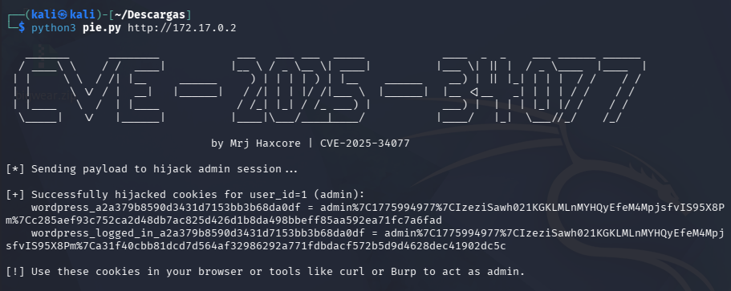

Podemos ver que el exploit ha funcionado y nos ha dado las cookies de inicio de sesión de administrador.
Las cookies te permiten entrar en la cuenta de otra persona sin saber ni su usuario ni contraseña, ya que el navegador entiende que ya has iniciado sesión.
Para que funcionen, nos meteremos en la página web, le daremos a la opcion de inspeccionar y en el apartado storage, cambiamos las cookies por las que te ha dado el exploit.

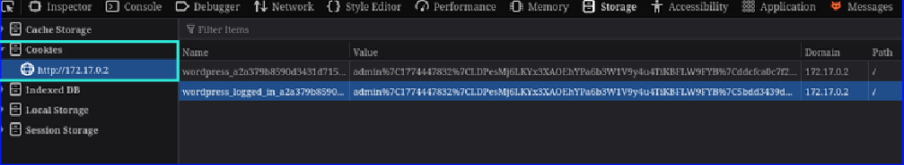

Recargamos la página y vemos que ha funcionado, tenemos administrador

### Paso 5 - Entrar al servidor

Una vez dentro, instalaremos como administradores que somos, una extensión de Wordpress llamada File Manager, desde la cual podremos ver y modificar los archivos del Wordpress en el servidor.

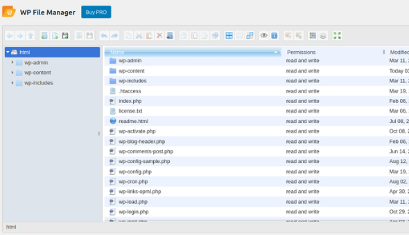

Teniendo acceso a los archivos, nos iremos a la página https://www.revshells.com/ y elegiremos el primer reverse shell que nos aparezca con PHP. Una vez ponemos la ip y el puerto que queremos usar, copiamos el códido y tras abrir index.php lo pegamos dentro.

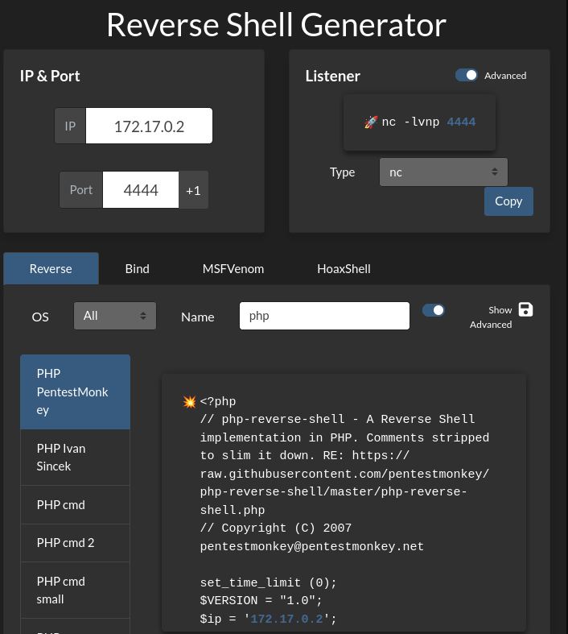

Tras esto, ponemos una terminal a escuchar el puerto que hemos puesto en el reverse shell y ejecutamos el archivo que contiene el codigo malicioso.

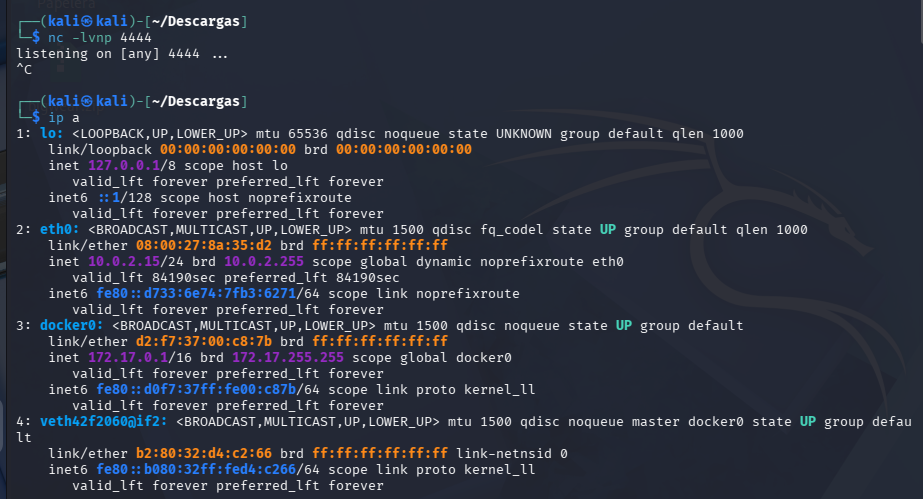

Y bingo, estamos dentro del servidor con una terminal en remoto. Lo primero que haremos será ver que permisos tenemos y que archivos podemos acceder, ademas de explorar los archivos que parezcan interesantes

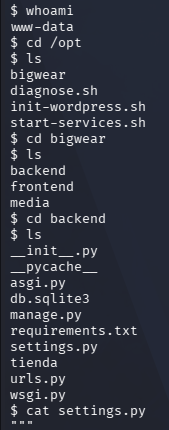

### Paso 6 - Escalar privilegios

Como podemos ver, tenemos permisos de usuario básico a si que buscaremos por los archivos para buscar datos interesantes. En el archivo settings.py, encontramos en un comentario credenciales de administrador.

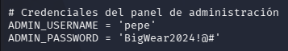

Una vez tenemos la contraseña, la probamos y efectivamente funciona

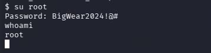


## Resultado final

Como hemos podido comprobar, hemos conseguido root en un servidor unicamente con una dirección IP.
El resultado del laboratorio incluye:

- Reportes de escaneo 
- Sesiones exitosas de reverse shell 
- Capturas de pantalla  
- Un informe técnico detallado  


---

## Conclusiones

Durante la elaboración del laboratorio se confirmará la importancia del reconocimiento previo y la correcta elección de objetivos. Nmap y WPscan combinados con un entorno virtualizado, permiten aprender pentesting de forma segura.

**Limitaciones:**  
El laboratorio está limitado a máquinas vulnerables preparadas.

## Consideraciones éticas

Todas las pruebas realizadas en este proyecto se han llevado a cabo en un entorno controlado y autorizado, utilizando máquinas vulnerables preparadas específicamente para prácticas educativas.

---


## Bibliografía

- Nmap Reference Guide — Nmap.org  
- Wpscan website - wpscan.com
- Metasploit Unleashed — Offensive Security  
- VirtualBox User Manual — Oracle  
- Metasploitable2 — Rapid7  
- DVWA — OWASP  
- Reddit — Foros sobre pentesting  
- Arenatech — Artículo sobre creación de laboratorio de pentesting  


---

